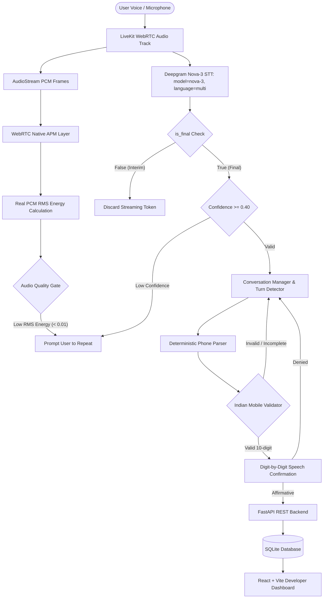

# VAIU AI — Voice Agent Phone Number Collection

[](https://www.python.org/)
[](https://fastapi.tiangolo.com/)
[](https://livekit.io/)
[](https://react.dev/)
[]()
[](LICENSE)

An enterprise-grade, deterministic multilingual voice agent whose sole purpose is to accurately collect valid 10-digit Indian mobile phone numbers through natural conversation.

Built with **LiveKit Agents (v1.8.5)**, **FastAPI**, **SQLAlchemy**, **SQLite**, and **React + Vite**.

---

## 📑 Table of Contents
- [Architecture & Data Flow](#-architecture--data-flow)
- [Key Features](#-key-features)
- [Technology Stack](#-technology-stack)
- [Project Structure](#-project-structure)
- [Deterministic Phone Number Parser](#-deterministic-phone-number-parser)
- [Voice Agent & Audio Processing](#-voice-agent--audio-processing)
- [Backend REST API & Database](#-backend-rest-api--database)
- [Developer Dashboard](#-developer-dashboard)
- [Getting Started & Local Setup](#-getting-started--local-setup)
- [Running Tests](#-running-tests)
- [2–3 Minute Demo Script](#-23-minute-demo-script)
- [Known Limitations & Future Improvements](#-known-limitations--future-improvements)

---

## 🏛 Architecture & Data Flow

The system explicitly decouples speech recognition and conversational pacing from phone number extraction. **No LLM is used to guess, invent, or infer phone numbers.** All phone parsing, repetition expansion, self-correction, validation, and confirmation detection are strictly **deterministic**.



---

## ✨ Key Features

1. **Deterministic Parsing Pipeline:** Zero LLM hallucinations. Multi-stage tokenizer, repetition expander (`double seven` $\to$ `77`, `triple nine` $\to$ `999`), and phonetic number mapper.
2. **Multilingual Speech Support:** Handles English (`zero`, `oh`), Hindi (`shunya`, `sifar`, `ek`, `do`, `teen`, `chaar`, `paanch`, `chhe`, `saat`, `aath`, `nau`), and Hinglish / mixed dialect phrases concurrently using Deepgram Nova-3 (`language="multi"`).
3. **Natural Grouping Flexibility:** Parses single digits, pairs (`98 76 54 32 10`), triplets (`987 654 321 0`), 5+5 (`98765 43210`), and continuous streams (`9876543210`).
4. **Pause Tolerance & Turn Detection:** Waits silently for up to 4 seconds while a number is incomplete, preventing premature agent interruption.
5. **Deterministic Self-Correction:** Detects speech pivot words (`sorry`, `wait`, `no`, `nahi`, `nahin`, `galat`, `scratch that`) and prioritizes the corrected recitation.
6. **Digit-by-Digit Confirmation:** Spells out digits individually (e.g., *"9, 8, 7, 6, 5, 4, 3, 2, 1, 0"*), preventing TTS engines from reading large numbers (e.g., *"nine billion..."*).
7. **Real Audio Processing & Quality Gate:** Subscribes to remote participant `AudioStream(track)`, calculates real PCM Root Mean Square (RMS) signal energy, and gates audio without hardcoded fake constants.
8. **Configurable Providers:** Pluggable STT (`Deepgram Nova-3` multilingual / `OpenAI Whisper`) and TTS (`ElevenLabs Multilingual v2` / `OpenAI TTS`).
9. **Developer Dashboard:** Live React dashboard showing total collected numbers, language distribution, search, filters, full transcript viewer, and record deletion.

---

## 🛠 Technology Stack

| Layer | Technologies |
|---|---|
| **Voice Agent Runtime** | Python 3.11+, LiveKit Agents SDK v1.8.5, Silero VAD |
| **Audio Processing** | WebRTC Native APM (`livekit.rtc.AudioProcessingModule`), Real PCM RMS Gate |
| **STT Providers** | Deepgram Nova-3 (`model="nova-3"`, `language="multi"`), OpenAI Whisper |
| **TTS Providers** | ElevenLabs (`eleven_multilingual_v2`), OpenAI TTS |
| **Backend API** | FastAPI 0.142.2, Uvicorn 0.54.0, Pydantic v2 |
| **Database & ORM** | SQLite, SQLAlchemy 2.1.3 |
| **Testing** | Pytest (108 unit and integration tests across 7 test suites) |
| **Dashboard** | React 18, Vite 5, Lucide Icons, Pure CSS |

---

## 📁 Project Structure

```text
voice-phone-agent/
│
├── agent/                         # Voice Agent implementation
│   ├── __init__.py                # Package exports
│   ├── main.py                    # Worker CLI & Interactive Tester
│   ├── session.py                 # LiveKit session & audio pipeline
│   ├── conversation.py            # State machine & pause/confirmation logic
│   ├── prompts.py                 # Spoken prompts & digit-by-digit formatter
│   └── audio.py                   # APM noise suppression & STT/TTS factories
│
├── parser/                        # Deterministic Parsing Engine
│   ├── __init__.py                # Parser exports
│   ├── phone_parser.py            # Tokenizer, repetition & digit pipeline
│   ├── language.py                # Deterministic language classifier (en/hi/mixed)
│   └── correction.py              # Self-correction detection & segmentation
│
├── backend/                       # FastAPI Backend
│   ├── __init__.py                # Package init
│   ├── main.py                    # FastAPI application & CORS
│   ├── database.py                # SQLAlchemy SQLite session engine
│   ├── models.py                  # PhoneRecord ORM model
│   ├── schemas.py                 # Pydantic v2 validation models
│   ├── crud.py                    # Database persistence operations
│   └── routes/                    # API routes
│       ├── __init__.py
│       └── phones.py              # /api/phone endpoints & masked logging
│
├── dashboard/                     # React + Vite Developer Dashboard
│   ├── src/
│   │   ├── App.jsx                # Main dashboard UI component
│   │   ├── main.jsx               # React entrypoint
│   │   └── index.css              # Custom styling
│   ├── index.html                 # HTML template
│   ├── package.json               # Node dependencies
│   └── vite.config.js             # Vite configuration
│
├── tests/                         # Comprehensive Pytest Suite (108 tests)
│   ├── test_phone_parser.py       # Grouping, words, repetitions, dialects
│   ├── test_validation.py         # 10-digit validation & confirmation intent
│   ├── test_language_detection.py # English, Hindi, and Hinglish classification
│   ├── test_api.py                # FastAPI REST endpoints & error handling
│   ├── test_conversation.py       # Conversation state machine & pause combining
│   ├── test_audio.py              # RMS calculation, gate rejection, APM layer
│   └── test_stt_and_audio.py      # Final vs interim filtering, event deduplication
│
├── conftest.py                    # Root pytest configuration
├── .env.example                   # Template environment variables
├── .gitignore                     # Git ignore rules
├── requirements.txt               # Pinned Python dependencies
├── LICENSE                        # MIT License
└── README.md                      # Comprehensive documentation
```

---

## 🧩 Deterministic Phone Number Parser

### Pipeline Stages

```
Raw Speech Transcript
       ↓
1. Normalization (Case, punctuation removal, whitespace collapse)
       ↓
2. Self-Correction Segmentation (Splits on "sorry", "wait", "no", "nahi", etc.)
       ↓
3. Candidate Segment Evaluation (Evaluates segments newest-first)
       ↓
4. Repetition Expansion ("double seven" → "seven seven", "triple 9" → "9 9 9")
       ↓
5. Spoken & Numeric Token Mapping (Maps English/Hindi words & numerals to digits)
       ↓
6. Country Code Stripping (Strips optional "+91", "91", or "0" prefix)
       ↓
7. Language Classification (Deterministic classification into 'en', 'hi', or 'mixed')
       ↓
8. Indian Mobile Validation (Exactly 10 digits starting with 6, 7, 8, or 9)
       ↓
Structured Output
```

### Supported Word Mappings
* **English:** `zero`, `oh` $\to$ `0`; `one` $\to$ `1`; `two` $\to$ `2`; `three` $\to$ `3`; `four` $\to$ `4`; `five` $\to$ `5`; `six` $\to$ `6`; `seven` $\to$ `7`; `eight` $\to$ `8`; `nine` $\to$ `9`.
* **Hindi & Variants:**
  * `0`: `shunya`, `sunya`, `sifar`, `sifir`, `shoony`
  * `1`: `ek`, `ik`
  * `2`: `do`, `doh`
  * `3`: `teen`, `tin`
  * `4`: `chaar`, `char`
  * `5`: `paanch`, `panch`
  * `6`: `cheh`, `chhe`, `chhah`, `che`
  * `7`: `saat`, `sat`
  * `8`: `aath`, `ath`
  * `9`: `nau`, `nav`
* **Repetitions:** `double` ($\times 2$), `triple` ($\times 3$), `quadruple` ($\times 4$).

### Output Format
```json
{
  "success": true,
  "number": "9876543210",
  "language": "mixed",
  "digits": 10,
  "reason": null
}
```

---

## 🎙 Voice Agent & Audio Processing

### 1. WebRTC Native Noise Suppression
Real-time audio passes through LiveKit's native `AudioProcessingModule` (APM):
- **Acoustic Echo Cancellation (AEC):** Prevents the agent's speaker output from re-triggering STT.
- **Automatic Gain Control (AGC):** Normalizes fluctuating volume levels from distant microphones.
- **Noise Suppression:** Attenuates stationary background hums, street traffic, and room reverberation.

### 2. Audio Quality & Confidence Gate
Before passing transcripts to the parser, the agent enforces quality gating:
- Rejects frames where PCM RMS signal energy is below the noise floor (`< 0.01`).
- Rejects transcripts where STT provider confidence falls below `0.40`.
- Instead of guessing or hallucinating, the agent politely prompts: *"I couldn't hear that clearly. Could you please repeat your 10-digit mobile number?"*

### 3. Pause Pacing & Turn Detection
* When a user recites a partial sequence (e.g., *"Nine eight seven six..."* and pauses for 3 seconds), the agent waits up to **4 seconds** (`INCOMPLETE_SILENCE_TIMEOUT = 4.0`).
* If the user resumes with *"...five four three two one zero"*, segments are concatenated and parsed seamlessly.
* If the 4-second timeout expires without remaining digits, the agent responds: *"I only got 4 digits. Could you please repeat your full 10-digit mobile number?"*

### 4. Affirmative / Negative Confirmation
* **Positive markers:** `yes`, `yeah`, `correct`, `right`, `that's correct`, `haan`, `han`, `sahi`, `sahi hai`, `bilkul`, `ji haan`, `theek hai`.
* **Negative markers:** `no`, `wrong`, `incorrect`, `galat`, `nahi`, `nahin`, `na`, `nope`, `not right`, `galat hai`, `try again`.
* Numbers are only committed to the database **after affirmative confirmation**.

---

## 🔌 Backend REST API & Database

The backend is built with FastAPI, SQLite, and SQLAlchemy.

### Endpoints

| Method | Endpoint | Description | Request / Query | Response Code |
|---|---|---|---|---|
| `GET` | `/health` | Service health status | None | `200 OK` |
| `POST` | `/api/phone` | Save validated phone record | `PhoneCreateRequest` | `201 Created` |
| `GET` | `/api/phone` | List phone records | `search`, `language`, `start_date`, `end_date` | `200 OK` |
| `GET` | `/api/phone/stats` | Aggregated count metrics | None | `200 OK` |
| `DELETE` | `/api/phone/{id}` | Delete record by ID | Path parameter `id` | `200 OK` |

### POST /api/phone Payload
```json
{
  "rawTranscript": "nine eight seven six five four three two one zero",
  "parsedNumber": "9876543210",
  "language": "en"
}
```

### Masked Logging for Privacy
All backend logs automatically mask phone numbers to safeguard PII:
```text
2026-10-07 18:08:06 [INFO] vaiu.backend.routes.phones: POST /api/phone - saving number ******3210 (lang: en)
2026-10-07 18:08:06 [INFO] vaiu.backend.routes.phones: Successfully saved phone record id=1 (******3210)
```

---

## 💻 Developer Dashboard

A clean, responsive dashboard designed for evaluation and monitoring:
- **Metrics Cards:** Total verified records, English, Hindi, and Mixed language counts.
- **Search & Filter:** Search by any digit sequence; filter by English, Hindi, or Mixed; filter by date range.
- **Interactive Transcript Modal:** Click any raw transcript to inspect the exact spoken words.
- **Record Management:** Instant live deletion with backend synchronization.
- **Loading & Error Handling:** Graceful offline, loading, and empty states.

---

## 🚀 Getting Started & Local Setup

### Prerequisites
- Python 3.11+
- Node.js v18+ and npm
- Git

### 1. Clone & Set Up Python Environment
```bash
git clone <your-repository-url>
cd voice-phone-agent

# Create and activate virtual environment
python -m venv .venv

# Windows PowerShell:
.\.venv\Scripts\Activate.ps1
# Linux / macOS:
# source .venv/bin/activate

# Install dependencies
pip install -r requirements.txt
```

### 2. Configure Environment Variables
Copy `.env.example` to `.env`:
```bash
cp .env.example .env
```
For local testing and offline dialog simulation, the default values in `.env.example` work out-of-the-box. When connecting to LiveKit Cloud, set your `LIVEKIT_URL`, `LIVEKIT_API_KEY`, `LIVEKIT_API_SECRET`, and STT/TTS credentials (`DEEPGRAM_API_KEY`, `ELEVENLABS_API_KEY`).

### 3. Start the FastAPI Backend
```bash
python -m uvicorn backend.main:app --reload --port 8000
```
* Backend API: `http://localhost:8000`
* Swagger Documentation: `http://localhost:8000/docs`
* Health Check: `http://localhost:8000/health`

### 4. Start the Developer Dashboard
In a new terminal:
```bash
cd dashboard
npm install
npm run dev
```
* Dashboard URL: `http://localhost:5173`

### 5. Run the Voice Agent

#### Option A: Interactive Local Tester (Zero Credentials Required!)
Test English, Hindi, Hinglish, pauses, self-corrections, and direct database persistence right from your terminal:
```bash
python -m agent.main test
```

#### Option B: LiveKit Cloud Worker
Connect to a LiveKit room in dev mode:
```bash
python -m agent.main dev
```

---

## 🧪 Running Tests

The test suite contains **108 automated tests** covering edge cases, Indian mobile validation rules, phonetic variants, repetitions, self-corrections, API endpoints, audio quality gate, APM initialization, and conversation flows.

Run all tests:
```bash
pytest -v
```

---

## 🎬 2–3 Minute Demo Script

Follow this structured flow for your evaluation screen recording:

| Step | Time | Action | What to Demonstrate |
|---|---|---|---|
| **1. Intro & Stack** | 0:00 – 0:25 | Show project files and start FastAPI backend + Dashboard. | Point out clean modular architecture, LiveKit 1.8 SDK, FastAPI, and React dashboard. |
| **2. English Spoken Input** | 0:25 – 0:50 | Run `python -m agent.main test`. Input: `nine eight seven six five four three two one zero`. | Agent parses number deterministically, reads it back digit-by-digit (`9, 8, 7, ...`), user responds `yes`, record saved! |
| **3. Hindi Input** | 0:50 – 1:15 | Input: `nau aath saat chhe paanch chaar teen do ek shunya`. | Show deterministic Hindi parsing, dialect support (`shunya`/`sifar`), and classification as `hi`. |
| **4. Pause Pacing (5+5)** | 1:15 – 1:35 | Input: `nine eight seven six five` $\to$ wait $\to$ type `pause` (or wait) $\to$ `four three two one zero`. | Demonstrate agent does NOT interrupt during mid-number pause, combines chunks seamlessly. |
| **5. Self-Correction** | 1:35 – 2:05 | Input: `nine eight seven wait sorry nine eight six seven five four three two one zero`. | Show deterministic detection of `wait sorry` and extraction of corrected `9867543210`. |
| **6. Dashboard Walkthrough** | 2:05 – 2:30 | Switch to browser `http://localhost:5173`. | Show live metrics (Total, English, Hindi), search filter, click transcript to expand modal, and delete a record. |

---

## 🔍 Known Limitations & Future Improvements
- **Regional Languages:** Expansion to Tamil, Telugu, Kannada, Bengali, and Marathi phonetic number systems.
- **Hardware Noise Suppression:** Integration with deep-learning noise suppression models (e.g., RNNoise or DeepFilterNet) for extreme acoustic environments.
- **DTMF Keypad Fallback:** Dual-tone multi-frequency fallback if audio signal-to-noise ratio remains persistently below acceptable limits.

---

## 📄 License
This project is open-source under the [MIT License](LICENSE).
# voice-agent-assignment

